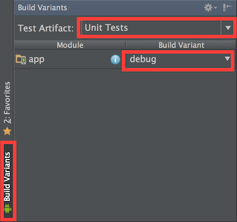
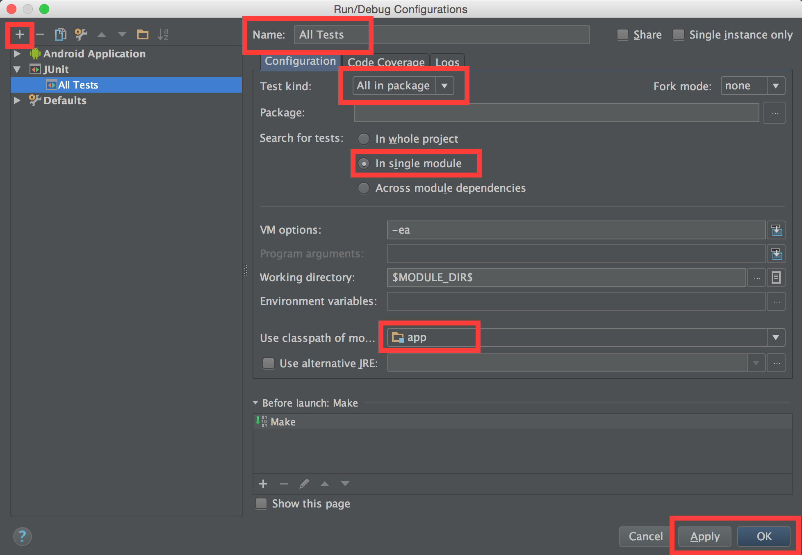

# Robolectric *Katas*

Use this repository a starting point to complete Android code *katas*.

Join [my newsletter](http://coreylatislaw.com/android-activity-book/) for updates about my upcoming book with Android *katas*.

# Import

The `master` branch has Robolectric preintegrated.

> Note: To become comfortable with integrating Robolectric, use the ["Hello, Robolectric" chapter of the Android Activity Book](https://gumroad.com/l/androidactivitybook) or my Pocket Guide to TDD with Robolectric (coming soon!) as a separate *kata*.

Simply import into Android Studio using the "Import Non-Android Studio project" option and selecting the top-level `build.gradle` file. 


# Test Artifact

In Android Studio, open the "Build Variants" tab and select "Unit Tests" as the "Test Artifact" and `debug` from the drop down next to `app`.



# Run Tests

Now that the project is set up, ensure the tests run.

Create a run configuration to run the tests from the IDE (my preferred method). Click the plus button, select "junit," and match the configuration shown here:



You can also run the tests from the command line, using `./gradlew check`.

Now that the project is configured, you're ready to work though some *katas*!

# Troubleshooting

## Junit Runtime Scope

If you get this error when using your run configuration, you used the wrong module name in your classpath when you configured it.

```
10:15:14 AM Error running Unnamed: No junit.jar in Module 'AndroidKatas' runtime scope
```

Change it to use `app` instead of `AndroidKatas`.

## `NoClassDefFoundError`: `ResultPrinter`

If you get this error:

```
Exception in thread "main" java.lang.NoClassDefFoundError: junit/textui/ResultPrinter
	at java.lang.Class.forName0(Native Method)
	at java.lang.Class.forName(Class.java:191)
	at com.intellij.rt.execution.application.AppMain.main(AppMain.java:122)
Caused by: java.lang.ClassNotFoundException: junit.textui.ResultPrinter
	at java.net.URLClassLoader$1.run(URLClassLoader.java:366)
	at java.net.URLClassLoader$1.run(URLClassLoader.java:355)
	at java.security.AccessController.doPrivileged(Native Method)
	at java.net.URLClassLoader.findClass(URLClassLoader.java:354)
	at java.lang.ClassLoader.loadClass(ClassLoader.java:425)
	at sun.misc.Launcher$AppClassLoader.loadClass(Launcher.java:308)
	at java.lang.ClassLoader.loadClass(ClassLoader.java:358)
	... 3 more

Process finished with exit code 1
```

It means that you forgot to select "Unit Tests" as the "Test Artifact" in the "Build Variants" window.

# Resources

* [Installation overview](http://robolectric.org/getting-started/)
* [Robolectric examples](https://github.com/robolectric/robolectric-samples/tree/master/android-flavors/src)
* [Integration + running](https://www.bignerdranch.com/blog/triumph-android-studio-1-2-sneaks-in-full-testing-support/)